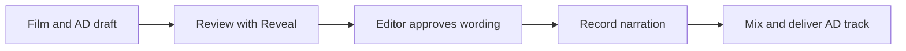
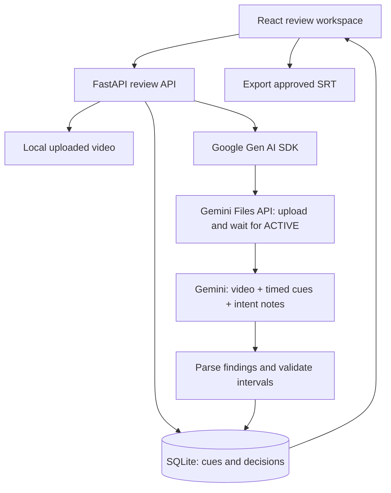

# Reveal

**Same suspense. Shared discovery.**

Reveal helps audio-description editors catch possible identity spoilers before a script is recorded. An editor brings a movie clip and a timed description draft; Gemini compares them, flags potentially premature character names, and suggests wording for the editor to review and export.

**Built for:** audio-description writers, accessibility reviewers, and film post-production teams. **Intended audience benefit:** help blind and low-vision viewers follow the action while discovering the story at its intended pace.

| Explore Reveal | Status |
| --- | --- |
| Demo video | [Watch the 2:37 Reveal demo on YouTube](https://youtu.be/py-tZLzaG-U) |
| Try the app | [Open the public Reveal demo](https://reveal--binepzai2004.replit.app/) |
| Hackathon submission | Devpost link coming soon |
| Run locally | [Quick start](#run-locally) |

Current scope: a public editorial-review demo on Replit. On September 7, 2026, a fresh hosted Gemini 3.6 Flash analysis of the synthetic demo film completed with one finding. Saving custom wording, reloading the review, mobile editorial controls, and revised SRT export were verified on the published app.

## The problem: a description can reveal too much

Imagine a scene built around an unidentified visitor. The picture conceals her identity, but the audio-description draft immediately calls her by name. A viewer relying on that description receives information earlier than the film intends.

Audio description conveys visual information through narration for blind and low-vision audiences. Captions convey dialogue and relevant sounds as text. Reveal currently reviews **visual-description scripts**, which serve a different purpose from dialogue captions. See [W3C's explanation of visual description](https://www.w3.org/WAI/media/av/description/).

The challenge is editorial: preserve useful detail without unnecessarily anticipating a reveal. Removing every character name would also make stories harder to follow. Reveal gives the reviewer a specific question to investigate, with the film and proposed wording close at hand.

## Research foundation

Our starting point is published industry guidance and accessibility research. These are desk-research findings, not interviews, customer studies, or a measured evaluation of Reveal.

| Finding | Why it matters for Reveal | Source |
| --- | --- | --- |
| Professional AD production involves watching the film, writing timed descriptions, recording narration, mixing, and quality checks. | Add assistance during script review, before recording. | [Descriptive Video Works: production workflow](https://descriptivevideoworks.com/faq) |
| Netflix advises generally waiting for a dialogue or plot introduction before naming characters, with exceptions for clarity, timing, and familiar characters. Deliberately unknown identities should remain unknown. | Flag possible issues while leaving the decision with an editor who understands context. | [Netflix Audio Description Style Guide, section 1.2 / WHO](https://partnerhelp.netflixstudios.com/hc/en-us/articles/215510667-Audio-Description-Style-Guide-v2-5) |
| A global study estimated 43.3 million people were blind in 2020, with a 95% uncertainty interval of 37.6–48.4 million. | Accessible storytelling concerns a substantial audience. This historical population estimate is not Reveal's customer count or market size. | [Bourne et al., Global Burden of Disease analysis](https://pubmed.ncbi.nlm.nih.gov/33275950/) |

These references establish the workflow and editorial concern. They do not establish how often identity spoilers occur, how accurately Reveal finds them, or how much time it saves. The referenced organizations are not claimed as customers or endorsers.

## Where Reveal fits



Reveal focuses on the review step. It does not currently write the first AD draft, generate the final narration, or mix an audio-description track. SRT is the MVP's timed-text interchange format; individual studios may use other authoring formats.

For a reviewer, the practical value is one workspace for the cue, the scene, the suggested change, and the editorial decision. Finding an issue before recording could reduce later corrections; time and cost savings still need to be measured.

## How it works

1. **Bring a scene and a draft.** Upload an MP4 or WebM clip and a separate UTF-8 `.srt` audio-description script. The movie does not need embedded captions. Add optional filmmaker notes about intended reveals.
2. **Run analysis.** In live mode, Reveal sends the clip, timed cues, and notes to Gemini through Google's Gen AI SDK.
3. **Inspect candidate findings.** Review the named character, explanation, suggested wording, evidence interval, and model-reported uncertainty. Seek through the clip to check the context.
4. **Make the editorial decision.** Edit and accept a proposal, dismiss it, or mark the wording intentional. Decisions remain human-controlled.
5. **Export the revised SRT.** Accepted findings contribute to the exported wording. The exporter uses original byte spans to preserve surrounding formatting for supported SRT inputs.

### A concrete example from the recorded demo

The walkthrough uses a **synthetic test film**, not a commercial film or a customer project.

| Moment | What happens |
| --- | --- |
| 00:05 | Draft cue: “Mara waits in the theater lobby.” |
| 01:06 | The synthetic scene reveals her identity on a staff badge. |
| Gemini's proposed revision | “A hooded figure stands in the theater lobby.” |
| Editor's accepted revision | “A hooded visitor waits in the theater lobby.” |

The demo opens a saved result from a successful Gemini API analysis and shows the real review, seeking, editing, and export workflow. It does not show a fresh inference completing during the recording. Later recording attempts encountered provider errors, so the successful result was retained and labeled **Recorded Gemini result / Synthetic clip**.

The bundled local sample is a separate workflow fixture involving Detective Vance and Dr. Aris Thorne. It is not the Mara film shown in the demo.

## Implemented features

| Capability | Current behavior |
| --- | --- |
| Video and script import | MP4/WebM, up to 200 MiB; UTF-8 SRT, up to 5 MiB; video container-header checks and timestamp parsing. |
| Gemini analysis | Video upload, processing-readiness polling, JSON response parsing, and candidate findings associated with cues. |
| Visible provider failures | Failed live calls produce a failed review with an error; they do not silently become offline results. |
| Editorial decisions | Accept, dismiss, mark intentional, edit proposed wording, and revisit decisions. |
| Reanalysis | Retains reviewed findings; changed accepted proposals are archived and flagged for re-review. |
| Concurrent requests | A database status claim rejects overlapping analysis requests for the same review with HTTP 409. |
| Multiple findings on one cue | Cue-level resolution combines accepted entity substitutions and uses custom wording as a base. Conflicting prose still warrants human inspection. |
| SRT export | Original-byte replacement preserves untouched content and tested BOM, padded-ID, spacing, and CRLF cases. |
| Review interaction | Cue and finding seeking, repeated seeking to the same timestamp, keyboard controls, and a text-oriented review view retaining playback and decision controls. |
| Persistence | SQLite locally or PostgreSQL through `DATABASE_URL`; reviews, decisions, and original SRT data are stored in the database. Media remains on the instance filesystem. |

Accessibility controls are implemented, but a formal accessibility audit and testing with blind and low-vision reviewers remain future work. Model-reported uncertainty is not a calibrated probability.

## How Gemini is used

Gemini performs the multimodal comparison at the center of the live review flow. The implementation is in [backend/analyzer.py](backend/analyzer.py).



The backend calls `client.files.upload`, polls `client.files.get`, and invokes `client.models.generate_content` with a JSON response configuration. Synchronous SDK work runs in a worker thread. Non-finite and invalid evidence intervals are rejected; media duration comes from `ffprobe` when available.

The code defaults to `gemini-2.5-flash`; the hosted demo sets `REVEAL_MODEL=gemini-3.6-flash` in Replit Secrets. Both the saved analysis shown in the recorded demo and the September 7 fresh hosted test report `google-genai/gemini-3.6-flash`. Each completed review records its `model_used`; available models and quotas depend on the configured account.

The verified live path uses the **Gemini Developer API** and an API key. Google Cloud hosting, Vertex AI, and Agent Builder deployment are not demonstrated by this implementation. A Cloud project environment variable alone does not establish those integrations.

### Live analysis and offline sample mode

| Mode | Configuration | Meaning of results |
| --- | --- | --- |
| Live Gemini | Set `GEMINI_API_KEY` or `GOOGLE_API_KEY`, with access to the selected model. | Gemini receives the video and script. Check `model_used` and review status. |
| Offline heuristic | Leave both API-key variables and `GOOGLE_CLOUD_PROJECT` empty. | Text rules generate sample findings. They do not inspect the film or verify reveal times. |

Offline findings contain a demo-rule label and synthetic intervals. Use this mode to explore the interface, not to assess a film's narrative. Live requests can incur API charges and send the clip, script, and notes to Google; use material you are authorized to process.

## Technology

| Layer | Tools |
| --- | --- |
| Interface | React 18, TypeScript, Vite, Lucide icons, HTML video |
| API | Python, FastAPI, Pydantic |
| Model integration | Google Gen AI SDK (`google-genai`), Gemini API |
| Persistence | SQLAlchemy, SQLite/aiosqlite or PostgreSQL/asyncpg |
| Media inspection | FFmpeg / ffprobe |
| Verification | pytest, pytest-asyncio, HTTPX; TypeScript and Vite build |
| Publishing | Replit; FastAPI serves the production frontend and API on port 5000 |

## Run locally

Prerequisites: Python 3.12 or newer, Node.js 20 or newer with npm, Git, and FFmpeg with `ffprobe` on `PATH`. The latest local verification used Python 3.12. A Gemini API key is required for real video analysis; offline exploration requires no model key.

Clone the repository once it is available to your GitHub account:

```sh
git clone https://github.com/vinhbin/reveal.git
cd reveal
python -m venv .venv
```

Activate the environment:

```powershell
# Windows PowerShell
.\.venv\Scripts\Activate.ps1
```

```sh
# macOS / Linux
source .venv/bin/activate
```

From the **repository root**:

```sh
python -m pip install -r backend/requirements.txt
python -m pip install python-dotenv
python -c "from pathlib import Path; p=Path('.env'); p.exists() or p.write_bytes(Path('.env.example').read_bytes())"
ffprobe -version
```

`python-dotenv` is declared in the requirements; the separate installation command is harmless if already installed. The copy command preserves an existing `.env`.

For live mode, edit the local `.env`:

```dotenv
GEMINI_API_KEY=YOUR_GEMINI_API_KEY
REVEAL_MODEL=gemini-3.6-flash
```

Keep the real key in `.env` or a hosting secret, never in frontend code or a commit. `GOOGLE_API_KEY` is an accepted alternative. `DATABASE_URL` is optional and defaults to local SQLite. Leave `GOOGLE_CLOUD_PROJECT` empty for the documented API-key setup.

Start the backend from the **repository root**, keeping this terminal open:

```sh
python -m uvicorn backend.main:app --host 127.0.0.1 --port 8001 --reload
```

In a second terminal, from the repository root:

```sh
cd frontend
npm ci
npm run dev
```

Open the frontend at `http://localhost:5000`. API health is at `http://127.0.0.1:8001/health`; interactive API documentation is at `http://127.0.0.1:8001/docs`.

Use the sample option to explore the workflow, or upload your own aligned clip and draft. When assessing real Gemini functionality, verify that the completed review reports a `google-genai/…` model rather than the offline analyzer. The health endpoint checks the application, not Gemini credentials or quota.

### Replit development workflow

The development workflow runs FastAPI on port 8001 and Vite on port 5000. Vite proxies API requests to the backend. Publishing uses the production startup below instead.

Live analysis requires a configured API key and available quota. Offline mode requires both API-key variables and the Google Cloud project setting to be empty; it does not inspect the video.


### Production startup

Replit installs Python dependencies from `pyproject.toml` and `uv.lock`. Its build runs:

```sh
uv sync --locked
npm --prefix frontend ci --include=dev
npm --prefix frontend run build
```

The production command is:

```sh
uv run --no-sync python -m uvicorn backend.production:app --host 0.0.0.0 --port 5000
```

Analysis calls have a five-minute application timeout and bounded SDK requests. Interrupted requests become visible failures. An abrupt process kill can still leave a review marked analyzing; automatic recovery after process termination is not implemented. Editing and deleting a review while analysis is running returns HTTP 409 to protect accepted wording.

### Verification commands

From the repository root, with the Python environment active:

```sh
python -m pytest -q backend/tests
```

From `frontend`:

```sh
npm run build
```

On September 7, 2026, all **36 backend tests passed**, including a regression for reconnecting closed idle database connections. The disconnect fix also passed an isolated PostgreSQL 16 probe. The production frontend built successfully with Vite 6.4.3, and npm audit reported zero advisories at that check. Sixteen local production-browser checks passed. The backend suite uses mocked model calls; these are engineering checks, not model-accuracy measurements.

Hosted verification separately confirmed a **fresh Gemini 3.6 Flash analysis** of the synthetic film, returning one finding. Six editorial API checks and seven browser checks then passed, covering decisions, custom wording, persistence after reload, mobile controls, and export. An earlier hosted pass verified upload validation, video range requests, exact-byte unchanged export, concurrency protection, sample creation, deletion, and 12 browser checks. Test-created reviews were removed after verification; existing visitor reviews were not modified.

Earlier hosted calls encountered quota exhaustion and temporary provider unavailability. One HTTP test connection also disconnected after the successful inference; subsequent requests over a fresh connection and the browser passed. A successful test does not guarantee ongoing provider or network availability.

The 2:37 demo was separately checked for decoding, playback, captions, and scene timing. Its successful recorded Gemini response demonstrates one synthetic example, not a benchmark across films.

### Troubleshooting

| Symptom | Check |
| --- | --- |
| `No module named backend` | Run the Uvicorn command from the repository root. |
| `No module named dotenv` | Install `python-dotenv` in the same environment running the backend. |
| UI loads but API requests fail | Start the backend on port 8001; the Vite development server proxies `/api` there. |
| Offline analyzer appears | Check environment variable presence and restart the backend after configuring the key. |
| Live analysis fails or times out | Inspect the review error and model access/quota; retry when the provider is available. Do not treat an error as an empty successful review. |
| Sample-duration test fails | Check that `ffprobe` is available and the bundled MP4 is present. |

## API and repository map

All review routes use `/api/reviews` as their prefix. The running API's `/docs` page is the detailed schema reference.

| Method | Route | Purpose |
| --- | --- | --- |
| POST | `/api/reviews` | Upload `title`, `video_file`, `srt_file`, and optional `intent_notes` as multipart form data. |
| POST | `/api/reviews/sample` | Create a session from bundled sample assets. |
| GET | `/api/reviews` | List review sessions. |
| GET | `/api/reviews/{id}` | Retrieve cues, findings, and review status. |
| POST | `/api/reviews/{id}/analyze` | Run analysis; overlapping requests return 409. |
| PATCH | `/api/reviews/{id}/findings/{finding_id}` | Update editorial status or proposed wording. |
| GET | `/api/reviews/{id}/video` | Serve uploaded video. |
| GET | `/api/reviews/{id}/export` | Download the revised SRT. |
| DELETE | `/api/reviews/{id}` | Delete the review and associated local files. |

- [Backend entry point](backend/main.py), [review API and cue resolution](backend/routes/reviews.py), [Gemini integration](backend/analyzer.py).
- [SRT parsing and export](backend/srt_parser.py), [database](backend/database.py), [tests](backend/tests).
- [Frontend workspace](frontend/src/components/ReviewWorkspace.tsx), [text review view](frontend/src/components/AccessibleTextView.tsx), [API client](frontend/src/api.ts).
- [Bundled sample script](backend/samples/sample_ad.srt), [sample video](backend/samples/sample_short.mp4), [environment template](.env.example).

## Current limits and next steps

**Editorial scope.** Reveal focuses on possible premature identity disclosures in an English-language clip and supplied script. It can miss earlier context outside that clip, misunderstand a scene, or propose unsuitable wording. Review the film and final export. It is not a complete AD quality checker or an accessibility certification tool.

**Public hosting.** This is intentionally a shared public demo with no per-user authentication or ownership boundary. Other visitors can access and change reviews. Use non-confidential test material. Separate accounts, durable media storage, and model-usage controls remain future work. `REVEAL_UPLOAD_DIR` can point to persistent storage when one is provisioned; setting it does not itself provision storage. Gemini uploads are now deleted on completion or failure on a best-effort basis.

**Deployment.** The published app uses `backend.production:app` to serve the compiled frontend and API together. Development still uses the separate Vite proxy. Code changes require a new Replit publish. The database can survive while local media disappears across deployments; durable media storage is not configured by this repository.

**Validation roadmap.** Evaluate with professional describers and blind/low-vision participants; build an annotated set of reveal and non-reveal scenes; measure precision, missed issues, reviewer time, false-positive burden, and comprehension. Use those results to assess usefulness before claiming productivity or cost savings.

**Product roadmap.** Improve full-film context, make conflicting custom revisions easier to reconcile, complete accessibility testing, and explore additional timed-script formats with practitioners.

## Hackathon status

Prepared for **Agentic Cinema: The Blockbuster Hackathon**, with Replit as the intended track. Replit Agent configured startup, proxying, dependencies, and PostgreSQL compatibility. The application is published on Replit, and a fresh hosted Gemini analysis plus the editorial export workflow have been verified. The source repository is public. Final Devpost submission and its link remain outstanding. This README describes product status and does not certify competition eligibility. See the [official event rules](https://agentic-cinema.devpost.com/rules).

## License

Reveal's repository code is provided under the [MIT License](LICENSE). Uploaded films and scripts remain subject to their own rights and permissions.
